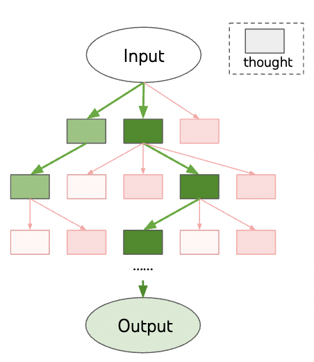
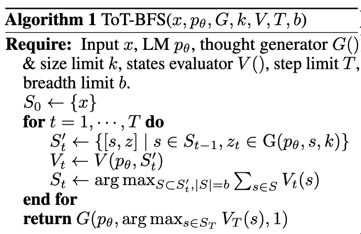

# Strategic Debate:

Strategic Debate is a Python library that implements various prompt engineering techniques for creating and evaluating persuasive arguments.

### Tree of Thoughts

Our first release is a [DSPy](https://dspy-docs.vercel.app/)-based implementation of the [Tree of Thoughts](https://arxiv.org/abs/2305.10601) framework, meant for crafting persuasive arguments in debates. 

This library extends the original [Tree-of-Thoughts repository](https://github.com/princeton-nlp/tree-of-thought-llm) by explicitly catering to argument generation and evaluation. We support both single-turn arguments and multi-turn debates, while allowing for the same flexibility in evaluation strategies as the original framework.



### Features

- Tree of Thoughts implementation for strategic argument generation and evaluation
- Support for both single-turn and multi-turn debates
- Flexible evaluation strategies: scoring and voting
- Customizable node selection strategies: greedy and weighted random
- Visualization of the argument tree with [Graphviz](https://graphviz.org/).
- Integration with OpenAI's language models

## How Tree-of-Thoughts Works

Tree-of-Thoughts is a sequential prompting framework that is meant to evoke complex reasoning and planning capabilities in language models. We apply the Tree-of-Thoughts framework to the task of generating persuasive arguments (rather than tasks like `game-of-24`, `crosswords` or `creative writing`, which were used in the original paper).

A core idea in Tree-of-Thoughts is iterative expansion of a tree structure. In this tree structure, nodes represent "thoughts" ($z_t$), which are textual responses that incorporate intermediate/reasoning steps towards a final response. As part of the tree structure, a "thought" in layer `t` creates a set of "child thoughts" in layer `t+1`. This is known as the "branching" step (by a component known in the original paper as "Thought Generator", $G()$). 

Since unmediated branching can lead to a combinatorial explosion, we use a "debate judge" to evaluate the quality of each child thought after each expansion. The "debate judge" is a model that scores the quality of a thought based on its quality (a component known in the original paper as "States Evaluator", $V()$). Only the top scoring nodes in layer `t+1` are retained for further expansion. This is known as the "selection" step. 

See the full psuedocode excerpt from [Tree-of-Thoughts](https://arxiv.org/pdf/2305.10601) which describes the process:



### Our Interpretation

We interpret the Tree-of-Thoughts framework as a way to generate persuasive arguments. Our library currently supports closed-source language models (`gpt-3.5-turbo`, `gpt-4o`, `gpt-4o-mini`) to serve as both the "Thought Generator" and the "States Evaluator".

Rather than viewing nodes in the tree as "thoughts", we view them as "argument states" (which can include context about both the existing conversation and previous drafts). The "thoughts" in the original paper are meant to be intermediate steps towards a final response. In our case, the "arguments" are meant to be intermediate drafts towards a final persuasive argument.

### Alternative Interpretations (and why we chose ours instead)

While we chose to iterate over drafts at each layer of the tree, it is also possible to consider alternative interpretations of the Tree-of-Thoughts framework:

* One could consider each layer of the tree as an "expansion" of the argument (i.e., a child node presents an argument that is more detailed than its parent). We chose not to go with this approach because we didn't want the depth of a tree to be directly proportional to the length of the output.

* Another alternative interpretation is to consider pre-defined "instructions" for each layer of the tree (e.g., the first layer is meant for planning, the second layer is meant for identifying relevant facts, etc...). However, this approach would require a lot of manual work to define the instructions for each layer, and is not necessarily generalizable or scalable.

We therefore chose to iterate over drafts at each layer of the tree, as it is a simple and generalizable approach that can be applied to a wide range of argument generation tasks.

## Installation

To install the Strategic Debate library, you must first clone or download the repository from GitHub:

```bash
git clone https://github.com/zbambergerNLP/tree-of-thoughts.git
```

Next, navigate to the local repository directory:

```bash
cd tree-of-thoughts
```

Create and activate a new Python virtual environment (we use Python 3.12):

```bash
python3.12 -m venv .env
source .env/bin/activate
```

Then, navigate to the repository directory and install the required dependencies:

```bash
pip install -r requirements.txt
```

### Optional Dependencies for Visualization
For visualization, you must install graphviz using the following command:

```bash
sudo apt-get install graphviz
```

Alternatively, on Mac, you can use the following command:

```bash
brew install graphviz
```

## Usage

Here's a basic example of how to use the Strategic Debate library:

```python
from strategic_debate import TreeOfThoughts, create_conversation_state
from utils import set_up_dspy

# Set up the environment
set_up_dspy(openai_key="your_openai_key_here")

# Initialize the conversation state
state = create_conversation_state(
    topic="The government should enforce regulation on AI technology.",
    stance="PRO",
    conversation_path="path/to/conversation.txt"
)

# Initialize the Tree of Thoughts module
tot = TreeOfThoughts(
    use_chain_of_thought=True,
    node_selection_strategy="greedy",
    evaluation_strategy="score"
)

# Generate the best argument
response = tot(
    state=state,
    depth=2,
    top_k=2,
    generation_temperature=0.7,
    judge_temperature=0.7,
    n_samples_generation=3,
    n_samples_judge=5,
    do_visualize_tree=True,
    do_save_tree=True,
    response_length="a few sentences"
)

print(f"Generated argument: {response}")
```

## Command-line Interface

The library also provides a command-line interface for easy experimentation:

```bash
python tree_of_thoughts.py --topic "AI regulation" --stance "PRO" --depth 2 --top_k 2
```

For a full list of command-line options and their full documentation, run:

```bash
python tree_of_thoughts.py --help
```

For a brief overview of the command-line options, see [Configuration](#configuration) section below.

## Configuration

The library offers various configuration options:

| Parameter | Description | Default Value |
| --- | --- | --- |
| `topic` | The topic of the debate. For example, "Collaboration is better than competition." | None |
| `stance` | The stance of the debator (a string). Must be one of [`"PRO"`, `"ANTI"`]. | None |
| `conversation_path` | The path to the conversation file. Each line in the file represents a message in the conversation. If no file is provided, conversation defaults to empty (`[]`). | None |
| `evaluation_strategy` | The strategy to use for evaluating the drafts. Must be one of [`"score"`, `"vote"`]. | `"score"` |
| `node_selection_strategy` | The strategy to use for selecting the nodes in the tree. Must be one of [`"greedy"`, `"sample"`]. | `"greedy"` |
| `generation_temperature` | The temperature to use when generating the drafts. A float between `0` and `1` | `0.7` |
| `judge_temperature` | The temperature to use when judging the drafts. A float between `0` and `1`. | `0.7` |
| `n_samples_generation` | The number of samples to generate for each response. | `3` |
| `n_samples_judge` | The number of samples to use when judging the drafts. | `5` |
| `top_k` | The number of best nodes to select at each step (according to the node selection strategy). | `2` |
| `depth` | The depth of the tree. The deeper the tree, the more reasoning is involved in producing candidate arguments. | `2` |
| `use_chain_of_thought` | Whether to use the chain of thought. | `True` |
| `max_tokens` | The maximum number of tokens to use when generating responses. | `1,000` |
| `model_name` | The name of the language model to use. One of [`gpt-3.5-turbo`, `gpt-4o`, `gpt-4o-mini`]. | `"gpt-4o-mini"` |
| `openai_key_path` | The path to the OpenAI key file. | None |
| `with_visualization` | Whether to visualize the tree of thought. Include this flag to include a visualization, and ommit it if you do not want to produce a visualization. | `False` |
| `with_saving` | Whether to save the tree of thought to a file. | `False` |
| `response_length` | The desired length of the response. Must be one of [`"a few sentences"`, `"a paragraph"`, `"a few paragraphs"`]. | `"a few sentences"` |


## Contributing

Contributions to the Strategic Debate library are welcome! 

Some of the ways you can contribute include:

1. Optimizing components of the Tree of Thoughts framework using [DSPy's optimizers](https://dspy-docs.vercel.app/docs/building-blocks/optimizers). Namely, we'd be interested in optimizing the efficacy of our debate judges using existing datasets for argument quality (e.g., [IBM-ArgQ-Rank-30kArgs](https://research.ibm.com/haifa/dept/vst/debating_data.shtml), [Change My View](https://convokit.cornell.edu/documentation/winning.html), [Persuasion For Good](https://convokit.cornell.edu/documentation/persuasionforgood.html), [Anthropic/persuasion](https://huggingface.co/datasets/Anthropic/persuasion), etc...).

2. Experimenting with the alternative forms of branching we suggested above (e.g., branching by expansion, branching by explicit layer-wise instructions, etc...).

For additional information on how to contribute, please reach out to Zachary Bamberger at `zacharybamberger1@gmail.com`.

## License

This is an open-source project licensed under the MIT License. See the LICENSE file for more information.

## Acknowledgments

This library implements the Tree of Thoughts framework as presented in Yao et al. (2023).

The Co-Creators of this library:

- Zachary Bamberger (Lead)
- Ze'ev Sheleg
- Yosef Ben Yehuda

The Supervisors of this project:
- Dr. Amir Feder (Google, Columbia University)
- Dr. Ofra Amir (Technion -- Israel Institute of Technology)

If you have any questions or concerns, please feel free to reach out to Zachary Bamberger at `zacharybamberger1@gmail.com`

If you wish to build on this work, please reference this repository:

```bibtex
@software{strategic-debate,
  author = {Zachary Bamberger, Ze'ev Sheleg, Yosef Ben Yehuda, Amir Feder, Ofra Amir},
  title = {Strategic Debate: Tree of Thoughts},
  year = {2024},
  publisher = {GitHub},
  url = {https://github.com/zbambergerNLP/tree-of-thoughts}
}